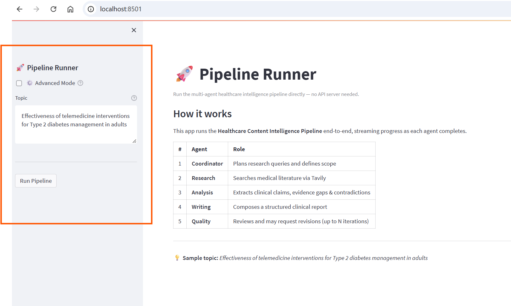
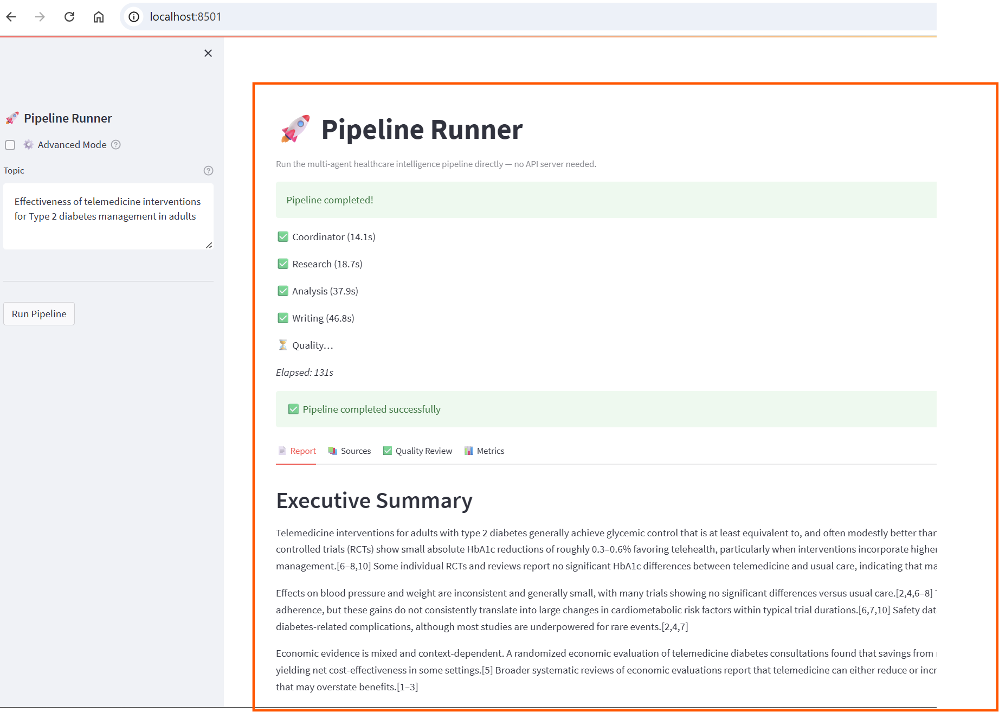
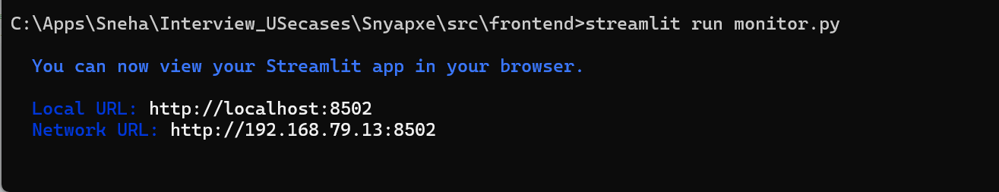

# Healthcare Content Intelligence Pipeline

A multi-agent clinical evidence synthesis system built with **LangGraph**, **Tavily**, **FastAPI**, and **Streamlit** — supporting both **Anthropic Claude** and **OpenAI GPT** models via a config-driven provider abstraction.

Given a healthcare topic, the pipeline automatically searches medical literature, extracts clinical claims, composes a structured report, and validates quality through an iterative review loop.

## Architecture

```
[User] ──→ Streamlit Pipeline UI Runner (runner.py) ──→ (no API, direct) ──→ LangGraph Pipeline
                                                                                    |
                                                                        ____________|
                                                                       │
                                         ┌─────────────────────────────┘
                                         ▼
                                  ┌─────────────┐
                                  │ Coordinator  │  Plan queries & scope
                                  └──────┬───────┘
                                         ▼
                                  ┌─────────────┐
                                  │  Research    │  Tavily search + dedup
                                  └──────┬───────┘
                                         ▼
                                  ┌─────────────┐
                                  │  Analysis    │  Extract claims & gaps
                                  └──────┬───────┘
                                         ▼
                                  ┌─────────────┐
                                  │  Writing     │  Compose markdown report
                                  └──────┬───────┘
                                         ▼
                                  ┌─────────────┐
                                  │  Quality     │──── pass ──→ [END]
                                  └──────┬───────┘
                                         │ revise (≤3 iterations)
                                         └──→ [Writing]

[Monitoring Dashboard (monitor.py)] ──→ reads logs/runs.sqlite + logs/runs/*.jsonl
```

## Quick Start

### 1. Install dependencies

```bash
pip install -r requirements.txt
```

### 2. Configure environment

```bash
cp .env.example .env.local
# Edit .env.local with your API keys:
#   OPENAI_API_KEY=sk-...          # default provider
#   ANTHROPIC_API_KEY=sk-ant-...   # if switching to anthropic in agents.yaml
#   TAVILY_API_KEY=tvly-...
```

Notes:
- `.env.local` is ignored by git and is the preferred place for secrets.
- `.env` is an optional fallback; `.env.local` takes precedence.

### 2a. Choose models/providers (config-only)

Per-agent provider/model settings are defined in `config/agents.yaml`. No code changes needed.

```yaml
# Default: all agents on OpenAI
coordinator:
  provider: openai
  model: gpt-5.1
  temperature: 0.3
  max_tokens: 1500
  timeout: 30

# Switch one agent to Claude:
analysis:
  provider: anthropic
  model: claude-3-5-sonnet-20241022
  temperature: 0.1
  max_tokens: 10000
  timeout: 180
```

### 3. Run tests (no API keys needed)

```bash
# Unit tests
pytest tests/unit/ -v

# Integration tests (all mocked)
pytest tests/integration/ -v

# All tests
pytest -v
```

### 4. EXECUTION: ( 2 SEPARATE USER INTERFACE):

### 4.A: Pipeline Runner (no API server needed)

Run the pipeline directly from the browser — no FastAPI required.

```bash
streamlit run src/frontend/runner.py
```

Features:
- **Simplified mode** (default): just type a topic and run
- **Advanced mode** (toggle): exposes scope, audience, format, and iteration controls
- Live agent-by-agent progress indicator during execution
- Results in tabs: Report | Sources | Quality Review | Metrics

#### Pipeline Runner Preview






### 4.B:  Monitoring Dashboard

View run metrics, agent performance, token usage, and quality trends:

```bash
streamlit run src/frontend/monitor.py
```

Dashboard tabs:
- **📋 Run History** — Sortable run table with inline drill-down (Gantt timeline, LLM calls, agent responses from log files)
- **⏳ Agent Performance** — Stacked duration bar, time-share pie, trend line
- **🪙 Token Usage** — Input/output per run, cumulative trend, per-agent averages
- **⭐ Quality** — Score trend, verdict distribution, iterations histogram, quality vs duration
- **🚨 Errors** — Failed runs table, daily error rate

Use the **Recent runs to display** slider in the sidebar to control chart density.

#### Monitoring Dashboard Preview




### Debug logs

```
logs/
├── runs.sqlite          # Structured metrics DB (runs, agent_steps, llm_calls)
├── agent_io.jsonl       # Global JSONL log (all runs)
└── runs/
    └── <run_id>.jsonl   # Per-run JSONL with full LLM I/O
└── artifacts/               # Per-run “renderable” outputs for Monitor drill-down
       └── <run_id>/
             ├── summary.json
             ├── quality.json
             ├── report.md         # present when report_markdown exists
             └── sources.json      # present when deduplicated_sources exists
```

Disable global log: `AGENT_IO_LOG_ENABLED=0`
Disable metrics DB: `RUN_DB_ENABLED=0`
Custom DB path: `RUN_DB_PATH=/path/to/runs.sqlite`

## Project Structure

```
  ├── config/
  │   ├── agents.yaml              # Per-agent provider/model/temperature/max_tokens/timeout
  │   ├── pipeline.yaml            # LangGraph pipeline config
  │   └── prompts.yaml             # Prompts for each agent
  ├── docs/
  │   └── PLAN.md                  # Implementation notes / plans
  ├── static/                      # Screenshots/GIFs used in docs/readme
  ├── src/
  │   ├── env.py                   # .env.local + .env loader
  │   ├── state/
  │   │   ├── schema.py            # PipelineState + shared state types
  │   │   └── models.py            # Pydantic models (agent outputs)
  │   ├── agents/                  # Coordinator/Research/Analysis/Writing/Quality agents
  │   │   └── base.py              # BaseAgent: LLM calls, JSON repair, logging hooks
  │   ├── llm/
  │   │   ├── agent_config.py      # Loads per-agent config from config/agents.yaml
  │   │   └── providers.py         # OpenAIProvider / AnthropicProvider (Gemini stub)
  │   ├── tools/                   # Tavily search + text utilities
  │   ├── graph/                   # LangGraph nodes, edges, builder
  │   ├── api/                     # FastAPI backend (models, routes, dependencies)
  │   ├── frontend/
  │   │   ├── runner.py            # Streamlit Pipeline Runner (direct graph, no API)
  │   │   ├── monitor.py           # Streamlit Monitoring Dashboard
  │   │   ├── app.py               # Streamlit app (API-backed)
  │   │   ├── api_client.py        # HTTP client for app.py
  │   │   └── components/          # Sidebar/progress/report view components
  │   ├── debug/
  │   │   ├── agent_io.py          # JSONL debug logger
  │   │   ├── run_db.py            # SQLite metrics + artifact persistence
  │   │   ├── agent_flow_debug.ipynb
  │   │   └── pipeline_flow_debug.ipynb
  │   ├── chainlit_app.py          # Chainlit UI (pipeline + agent chat)
  │   └── chainlit.md
  ├── tests/
  ├── logs/                        # Auto-created at runtime
  │   ├── agent_io.jsonl           # Global JSONL log stream
  │   ├── runs.sqlite              # Metrics DB (runs, agent_steps, llm_calls)
  │   ├── runs/                    # Per-run JSONL logs
  │   │   └── <run_id>.jsonl
  │   └── artifacts/               # Per-run “renderable” outputs for Monitor drill-down
  │       └── <run_id>/
  │           ├── summary.json
  │           ├── quality.json
  │           ├── report.md         # present when report_markdown exists
  │           └── sources.json      # present when deduplicated_sources exists
  ├── requirements.txt
  ├── README.md
  ├── .env.example
  └── .env.local                   # local secrets (gitignored)
```

## API Endpoints

| Method | Endpoint | Description |
|--------|----------|-------------|
| GET | `/api/v1/health` | Health check |
| POST | `/api/v1/pipeline/run` | Launch a pipeline run |
| GET | `/api/v1/pipeline/{run_id}/status` | Poll run status |
| GET | `/api/v1/pipeline/{run_id}/stream` | SSE status stream |
| GET | `/api/v1/pipeline/{run_id}/report` | Get final report |

## Framework Justification

**LangGraph** was chosen for orchestration because:
- **Explicit state graph**: The pipeline's sequential flow with a conditional revision loop maps naturally to a directed state graph. LangGraph makes the topology visible and auditable.
- **Typed shared state**: `PipelineState` (TypedDict) flows through every node, eliminating implicit coupling between agents. Each agent reads only what it needs and writes only its own outputs.
- **Built-in revision loops**: Conditional edges (`quality_routing`) handle the write→quality→revise cycle with a single declarative edge definition — no manual loop bookkeeping.
- **Async-native**: `graph.ainvoke()` / `graph.astream()` integrate cleanly with FastAPI's async model and Streamlit's threading approach.

**Tavily** was chosen over raw web scraping because it provides relevance-scored results with content snippets, supports healthcare domain filtering, and avoids the maintenance overhead of a custom scraper.

**Config-driven provider abstraction** (`config/agents.yaml` + `src/llm/providers.py`) allows switching LLM providers per-agent without touching code — useful for optimising cost/performance by assigning lighter models to simpler agents.

## Performance Considerations

- **Runtime bounding**: Each agent call is bounded at ≤180s via configurable `timeout` in `agents.yaml`. Prompts include explicit item/length limits to keep responses concise.
- **Token efficiency**: `WritingAgent` requests sections-only JSON and assembles `report_markdown` locally, reducing output size and truncation risk.
- **Input context bounding**: `AnalysisAgent` limits source input to top-N sources with shorter snippets to reduce latency.
- **SQLite WAL mode**: The metrics DB uses WAL journaling + `busy_timeout` for safe concurrent access during multi-agent parallel scenarios.
- **Stateless agents**: Each LangGraph node instantiates a fresh agent, so config changes take effect on the next run without restarts.
- **Streamlit caching**: The monitoring dashboard uses `@st.cache_data(ttl=30)` on all DB queries to avoid redundant reads on every rerender.
- **Scalability path**: The in-memory `run_store` (FastAPI) is suitable for single-server demo. Production would swap it for Redis or a shared DB with the existing `run_db.py` schema.

## Future Enhancements

- **Vector search / RAG**: Replace Tavily with a hybrid retrieval layer (dense embeddings + BM25) over an indexed corpus of medical literature for reproducible, citation-stable results.
- **Structured citations**: Auto-resolve DOIs and format citations to APA/Vancouver standards using CrossRef/PubMed APIs.
- **Parallel research**: Fan out research queries concurrently (LangGraph map-reduce pattern) to reduce total wall-clock time.
- **Human-in-the-loop**: Add a review step after Quality where a human can approve, reject, or annotate the report before finalisation.
- **Agent memory**: Persist coordinator research plans and quality feedback across sessions to improve consistency on recurring topics.
- **Multi-modal support**: Extend the pipeline to ingest PDFs, clinical guidelines, and structured datasets (CSV/FHIR) as additional evidence sources.
- **Streaming report output**: Stream `report_markdown` token-by-token to the Streamlit UI via SSE for perceived performance improvement on long reports.
- **Production deployment**: Containerise with Docker Compose (FastAPI + worker + Redis), add authentication, rate limiting, and audit logging.

## Tech Stack

| Layer | Technology |
|-------|-----------|
| LLM | OpenAI GPT (default) / Anthropic Claude (switchable per-agent) |
| Search | Tavily (healthcare domain filtering) |
| Orchestration | LangGraph (StateGraph) |
| Backend | FastAPI + SSE |
| Frontend | Streamlit (3 apps) + Chainlit |
| Metrics | SQLite (WAL mode) + JSONL logs |
| Testing | pytest + pytest-asyncio |
